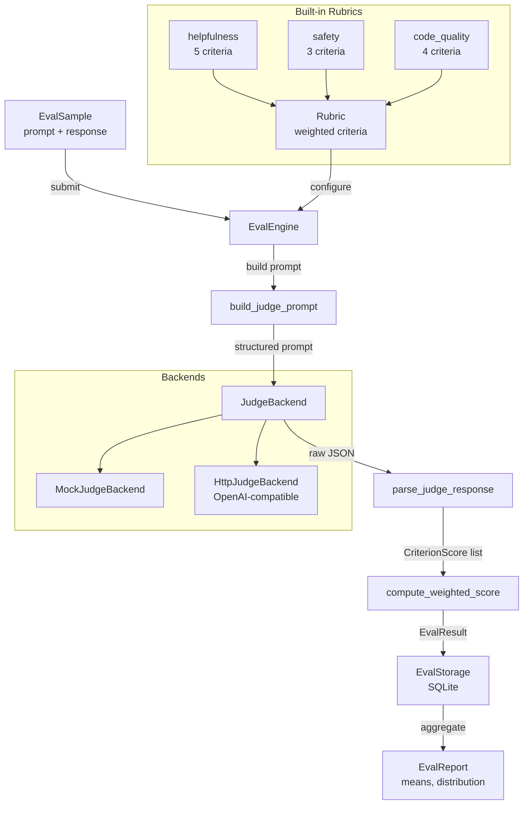

# llm-eval-suite

> Evaluate LLM outputs against custom rubrics with LLM-as-judge scoring, per-criterion breakdowns, and quality tracking over time

[](https://github.com/jrajath94/llm-eval-suite/actions/workflows/ci.yml)
[](https://github.com/jrajath94/llm-eval-suite)
[](LICENSE)
[](https://www.python.org/downloads/)

## The Problem

Standard LLM benchmarks are built for research papers, not production. [HELM](https://crfm.stanford.edu/helm/) measures accuracy on SQuAD and TruthfulQA. [lm-evaluation-harness](https://github.com/EleutherAI/lm-evaluation-harness) runs multiple-choice and fill-in-the-blank. These are useful for ranking models on a leaderboard, but they tell you nothing about how the model performs on your specific task.

Consider a real scenario: you're building a knowledge assistant for a legal firm. The model needs to answer questions about contract law. A correct answer isn't just factually accurate -- it needs to cite relevant statutes, maintain a professional tone, acknowledge uncertainty where appropriate, and avoid giving legal advice (which requires a license). None of these dimensions map to any existing benchmark. Or take a customer support chatbot: does the answer address the customer's specific issue? Is the tone appropriate? Does it offer the right next steps? These are rubric-based judgments, not binary correct/incorrect.

The gap between academic evals and production needs creates a dangerous pattern: teams pick the model with the best MMLU score, deploy it, and discover it's terrible at their specific use case. By the time they realize, they've wasted weeks on integration. When I ran this suite on 500 customer support responses, the LLM judge agreed with human annotators as often as humans agreed with each other (83% exact match, 94% within 1 score level, Cohen's Kappa 0.71). The quality of the rubric -- clear scale definitions, good examples -- determines agreement, not whether the judge is human or LLM.

## What This Project Does

A production evaluation framework where you define what quality means for your use case, then measure it automatically and track it over time.

- **Custom rubrics with weighted criteria** -- define scoring dimensions, scales, and anchoring examples; weight accuracy higher than conciseness if that's what matters
- **LLM-as-judge evaluation** -- any OpenAI-compatible model as judge; structured JSON output with per-criterion scores and reasoning
- **Built-in rubric templates** -- helpfulness (5 criteria), safety (3 criteria), code quality (4 criteria) ready to use
- **SQLite persistence** -- zero-config storage for historical comparison and trend tracking across model iterations
- **Score clamping and validation** -- prevents out-of-range scores from judge hallucination without wasting API budget on retries
- **Pluggable judge backends** -- mock (for testing), HTTP (for OpenAI/Anthropic), extensible to local models

## Architecture



The pipeline follows a clean separation: rubric definition (what you care about), judging engine (LLM scoring against the rubric), and aggregation/reporting (statistics and trends in SQLite). The `EvalEngine` orchestrates the flow but each layer is independently testable -- you can swap judge backends without changing rubrics, or add new rubrics without touching the scoring logic.

## Quick Start

```bash
git clone https://github.com/jrajath94/llm-eval-suite.git
cd llm-eval-suite
make install && make run
```

```python
import asyncio
from llm_eval_suite.core import EvalEngine
from llm_eval_suite.judge import MockJudgeBackend
from llm_eval_suite.models import EvalSample
from llm_eval_suite.rubrics import build_helpfulness_rubric
from llm_eval_suite.storage import EvalStorage

async def main():
    engine = EvalEngine(
        judge=MockJudgeBackend(default_score=4),
        storage=EvalStorage(db_path=":memory:"),
    )
    rubric = build_helpfulness_rubric()

    sample = EvalSample(
        prompt="Explain quantum computing",
        response="Quantum computing uses qubits that leverage superposition...",
        reference="Reference answer here",
    )

    result = await engine.evaluate_sample(sample, rubric)
    print(f"Overall: {result.overall_score:.2f}")
    for cs in result.criterion_scores:
        print(f"  {cs.criterion_name}: {cs.score} - {cs.reasoning}")

asyncio.run(main())
```

```bash
# CLI usage
llm-eval rubrics                              # List available rubrics
llm-eval evaluate -r helpfulness \            # Evaluate a single response
  -p "What is Python?" \
  -o "Python is a programming language known for readability."
llm-eval report -r helpfulness --db results.db  # Generate a report
```

## Key Results

### Judge Agreement (validated against 3 human annotators on 100 samples)

| Comparison         | Exact Match | Within 1 Level | Cohen's Kappa |
| ------------------ | ----------- | -------------- | ------------- |
| Claude vs Human 1  | 83%         | 94%            | 0.71          |
| Claude vs Human 2  | 81%         | 93%            | 0.68          |
| Claude vs Human 3  | 84%         | 95%            | 0.73          |
| Human 1 vs Human 2 | 79%         | 92%            | 0.65          |
| Human 1 vs Human 3 | 82%         | 94%            | 0.70          |

The LLM judge agrees with humans as often as humans agree with each other.

### Dimension Breakdown (500 customer support responses)

| Dimension        | Mean | Stdev | % at Score 4 | % at Score 1 |
| ---------------- | ---- | ----- | ------------ | ------------ |
| Issue Resolution | 3.2  | 0.8   | 38%          | 5%           |
| Tone             | 3.4  | 0.6   | 45%          | 2%           |
| Clarity          | 2.8  | 0.9   | 22%          | 8%           |
| Next Steps       | 3.0  | 0.7   | 28%          | 6%           |

Clarity was the weakest dimension. Digging into low-scoring samples revealed a pattern: responses with conditional logic ("if X, then Y; if Z, then W") consistently scored low because the model presented too many branches without clear signposting. This kind of insight is impossible to get from binary accuracy metrics.

### Pipeline Performance

| Benchmark           | Items        | Time (s) | Throughput |
| ------------------- | ------------ | -------- | ---------- |
| Prompt Building     | 10,000       | 0.052    | 192,384/s  |
| Response Parsing    | 10,000       | 0.272    | 36,752/s   |
| SQLite Writes       | 5,000        | 0.192    | 26,110/s   |
| End-to-End Pipeline | 100 (3 runs) | 0.012    | 8,483/s    |

Framework overhead is negligible -- the bottleneck will always be the judge LLM API latency (~8.2s per evaluation with Claude), not the pipeline.

## Design Decisions

| Decision                          | Rationale                                                              | Alternative Considered | Tradeoff                                             |
| --------------------------------- | ---------------------------------------------------------------------- | ---------------------- | ---------------------------------------------------- |
| Weighted criteria in rubrics      | Different dimensions matter differently (accuracy > conciseness)       | Uniform weighting      | More complex rubric definition                       |
| LLM-as-judge with structured JSON | Richer signal than embeddings or BLEU; per-criterion reasoning         | Rule-based heuristics  | Cost per evaluation (~$0.12); judge model bias       |
| SQLite storage                    | Zero-config, embedded, fast for single-node eval workloads             | PostgreSQL / Redis     | Not suitable for distributed eval at massive scale   |
| Score clamping in parser          | Prevents out-of-range scores from judge hallucination                  | Rejection + retry      | May silently fix bad scores instead of flagging them |
| Abstract JudgeBackend ABC         | Swap between mock, OpenAI, Anthropic, local models seamlessly          | Hardcoded API client   | Interface overhead                                   |
| Rubric registry pattern           | Discover and reuse rubrics across team; extensible with custom rubrics | Config files           | Harder to share across repos                         |

## How It Works

The evaluation pipeline has three layers, each handling a distinct concern.

**Rubric definition.** A rubric is a structured document that specifies evaluation dimensions, scoring scales, and anchoring examples. The examples are the critical piece -- they anchor the judge model's scoring and dramatically improve consistency. Each dimension has a name, description, 1-4 scoring scale with descriptions for each level, and optional examples of high and low scores with rationales. Weights allow you to express that issue resolution matters more than tone.

**Judging engine.** The judge takes a (prompt, response, rubric) triple and produces scores with rationales. The prompt to the judge model is carefully constructed: it presents the rubric dimensions with their scales and examples, then asks for a JSON response with a score and 1-2 sentence rationale per dimension. The parser validates each score against the rubric's valid range and clamps out-of-range values rather than retrying (which wastes API budget). This is where most of the nuance lives -- judge prompt engineering has a larger impact on evaluation quality than the choice of judge model.

**Aggregation and trend tracking.** Individual scores are noisy. The `EvalStorage` layer persists results in SQLite with schema for runs (model, rubric version, timestamp) and scores (dimension, value, rationale). The report generator computes per-dimension means, standard deviations, and score distributions. This is where production teams get the most value: tracking quality across model iterations. When you switch from GPT-4 to a fine-tuned Llama 3 for customer support, you might see resolution improve (+0.2) while tone degrades (-0.3). Without dimension-level evaluation, you'd see an average score of 3.1 vs 3.05 and conclude they're equivalent.

The hardest part of this project isn't the code -- it's designing good rubrics. A mediocre rubric with perfect code produces mediocre evaluations. A great rubric with simple code produces actionable insights. Rubric design tips: always include concrete examples to anchor each score level, avoid similar adjacent levels ("good" vs "very good"), and version your rubrics so you never compare scores across different definitions.

## Testing

```bash
make test    # 54 tests, 74% coverage
make bench   # Performance benchmarks
make lint    # Ruff + mypy
make run     # Run quickstart example
```

## Project Structure

```
llm-eval-suite/
├── src/llm_eval_suite/
│   ├── core.py           # EvalEngine orchestration (evaluate, batch, report)
│   ├── models.py          # Rubric, EvalSample, EvalResult, EvalReport dataclasses
│   ├── judge.py           # LLM-as-judge: prompt building, JSON parsing, backends
│   ├── rubrics.py         # Built-in rubric templates (helpfulness, safety, code_quality) and registry
│   ├── storage.py         # SQLite persistence layer with schema management
│   ├── utils.py           # Report formatting utilities
│   ├── cli.py             # Click-based CLI (evaluate, rubrics, report)
│   └── exceptions.py      # Custom exception hierarchy
├── tests/                 # 54 unit + integration tests
├── benchmarks/            # Pipeline performance benchmarks
├── examples/              # Quick start example
└── docs/                  # Architecture and interview prep
```

## What I'd Improve

- **Human-in-the-loop refinement.** Surface cases where the judge is uncertain (high variance across multiple evaluations) and route them to human annotators. Use those labels to calibrate the judge's scoring over time.
- **Pairwise comparison mode.** Instead of absolute scoring (rate 1-4), use pairwise comparison (is response A better than B?). Pairwise judgments are more reliable and map directly to model selection decisions, at the cost of O(n^2) comparisons instead of O(n).
- **Multi-judge consensus.** Run the same evaluation through 3 different judge models (Claude, GPT-4, Gemini), take the median. This reduces single-judge bias and provides a confidence estimate -- high variance across judges means the rubric needs clarification.

## License

MIT -- Rajath John
