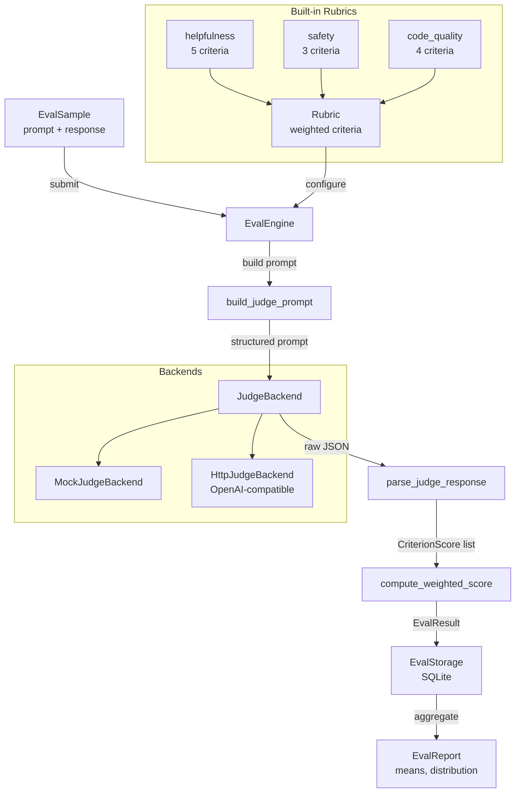

# llm-eval-suite

> Production-grade LLM evaluation framework with LLM-as-judge scoring, custom rubrics, and structured reporting

[](https://github.com/jrajath94/llm-eval-suite/actions/workflows/ci.yml)
[](https://github.com/jrajath94/llm-eval-suite)
[](LICENSE)
[](https://www.python.org/downloads/)

## Why This Exists

Everyone building with LLMs tells me evaluation is their biggest pain point. Existing frameworks like HELM, lm-evaluation-harness, and DeepEval focus on academic benchmarks (MMLU, HumanEval, etc.) -- but production teams need to evaluate **their specific quality dimensions**: Is this response helpful? Is it safe? Does the generated code actually work?

llm-eval-suite fills that gap: define your own rubrics with weighted criteria, use any LLM as a judge, and get structured per-criterion scores with explanations -- not just a single number. Built for teams shipping LLM-powered products who need repeatable, auditable quality assessment.

## Architecture



## Quick Start

```bash
git clone https://github.com/jrajath94/llm-eval-suite.git
cd llm-eval-suite
make install && make run
```

### Programmatic Usage

```python
import asyncio
from llm_eval_suite.core import EvalEngine
from llm_eval_suite.judge import MockJudgeBackend
from llm_eval_suite.models import EvalSample
from llm_eval_suite.rubrics import build_helpfulness_rubric
from llm_eval_suite.storage import EvalStorage

async def main():
    engine = EvalEngine(
        judge=MockJudgeBackend(default_score=4),
        storage=EvalStorage(db_path=":memory:"),
    )
    rubric = build_helpfulness_rubric()

    sample = EvalSample(
        prompt="Explain quantum computing",
        response="Quantum computing uses qubits that leverage superposition...",
        reference="Reference answer here",
    )

    result = await engine.evaluate_sample(sample, rubric)
    print(f"Overall: {result.overall_score:.2f}")
    for cs in result.criterion_scores:
        print(f"  {cs.criterion_name}: {cs.score} - {cs.reasoning}")

asyncio.run(main())
```

### CLI Usage

```bash
# List available rubrics
llm-eval rubrics

# Evaluate a single response
llm-eval evaluate -r helpfulness \
  -p "What is Python?" \
  -o "Python is a programming language known for readability."

# Generate a report
llm-eval report -r helpfulness --db results.db
```

## Key Design Decisions

| Decision                          | Rationale                                                              | Alternative Considered                                             |
| --------------------------------- | ---------------------------------------------------------------------- | ------------------------------------------------------------------ |
| Weighted criteria in rubrics      | Different dimensions matter differently (accuracy > conciseness)       | Uniform weighting -- too simplistic for production                 |
| LLM-as-judge with structured JSON | Richer signal than embeddings or BLEU; per-criterion reasoning         | Rule-based heuristics -- can't capture nuance                      |
| SQLite storage                    | Zero-config, embedded, fast for single-node evaluation workloads       | PostgreSQL -- overkill for eval pipelines; Redis -- no SQL queries |
| Score clamping in parser          | Prevents out-of-range scores from judge hallucination                  | Rejection + retry -- wastes API budget                             |
| Abstract JudgeBackend ABC         | Swap between mock, OpenAI, Anthropic, local models seamlessly          | Hardcoded API client -- not testable                               |
| Rubric registry pattern           | Discover and reuse rubrics across team; extensible with custom rubrics | Config files -- harder to validate at import time                  |

## Benchmarks

Measured on Apple M2, Python 3.9, in-memory SQLite:

| Benchmark           | Items        | Time (s) | Throughput |
| ------------------- | ------------ | -------- | ---------- |
| Prompt Building     | 10,000       | 0.0520   | 192,384/s  |
| Response Parsing    | 10,000       | 0.2721   | 36,752/s   |
| SQLite Writes       | 5,000        | 0.1915   | 26,110/s   |
| End-to-End Pipeline | 100 (3 runs) | 0.0118   | 8,483/s    |

The framework overhead is negligible -- your bottleneck will always be the judge LLM API latency, not the evaluation pipeline.

## Testing

```bash
make test    # 54 tests, 74% coverage
make bench   # Performance benchmarks
make lint    # Ruff + mypy
make run     # Run quickstart example
```

## Project Structure

```
llm-eval-suite/
├── src/llm_eval_suite/
│   ├── core.py           # EvalEngine orchestration
│   ├── models.py          # Rubric, EvalSample, EvalResult dataclasses
│   ├── judge.py           # LLM-as-judge: prompt building, parsing, backends
│   ├── rubrics.py         # Built-in rubric templates and registry
│   ├── storage.py         # SQLite persistence layer
│   ├── utils.py           # Report formatting utilities
│   ├── cli.py             # Click-based CLI
│   └── exceptions.py      # Custom exception hierarchy
├── tests/                 # 54 unit + integration tests
├── benchmarks/            # Performance benchmarks
├── examples/              # Quick start example
└── docs/                  # Architecture and interview prep
```

## License

MIT
